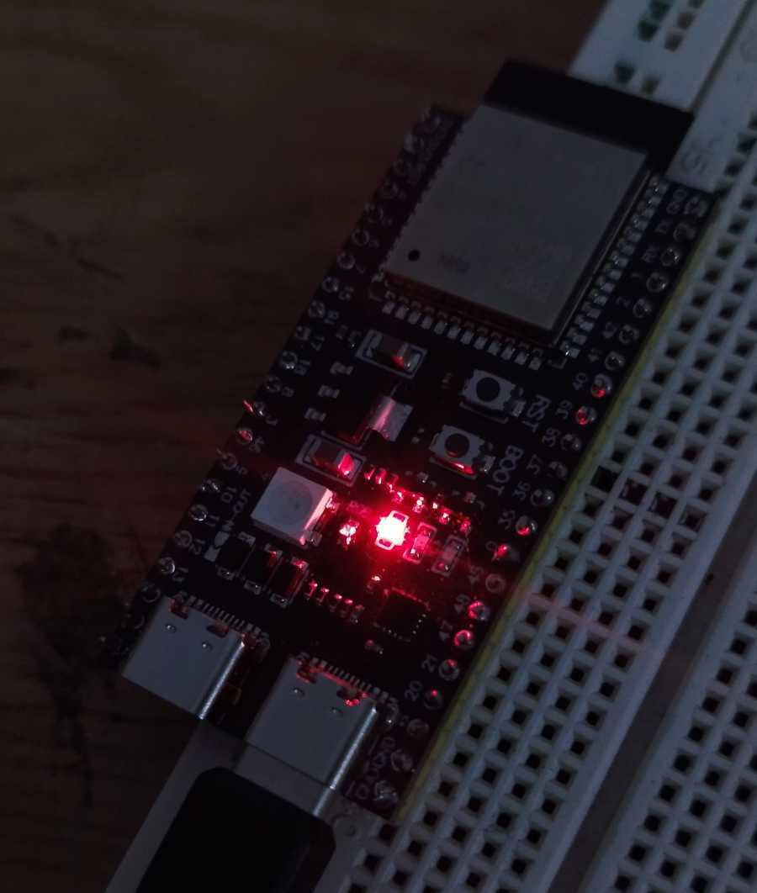
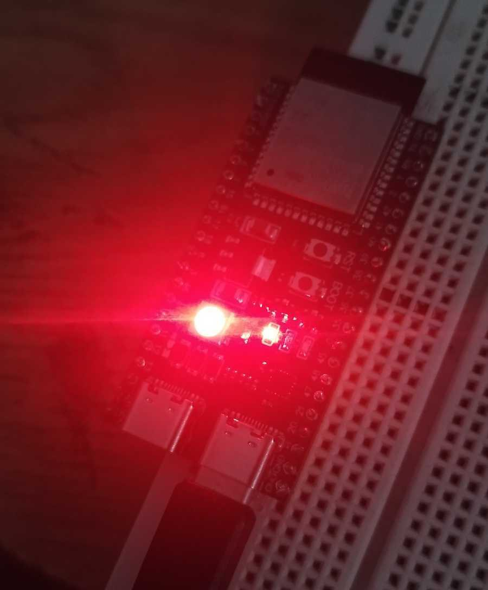
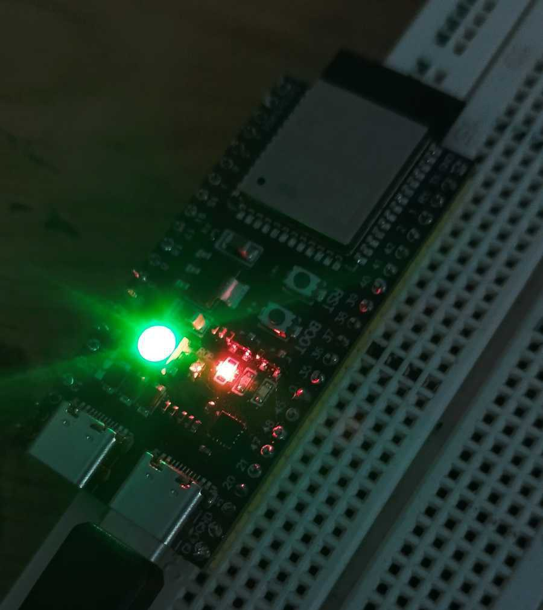
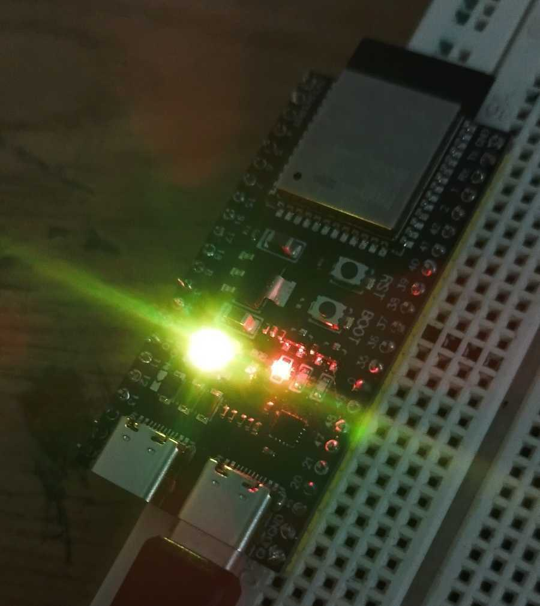

# 🖼️ ESP32 S3 Image


# ⏰ Time Sync Alert with NeoPixel (ESP32 + Python API)

This project enables an ESP32 (or compatible board) to periodically fetch scheduled time from a local Python API, compare it with the current local time, and notify via NeoPixel LED if the event is approaching.

---

## 📦 Project Structure
- `language Python`
- `language C++ (Arduino)`
- `Sample file Json `
- `ESP32 S3 (Board)`
---

## 🔌 Hardware Requirements

- ESP32 board (or similar)
- 1x WS2812 (NeoPixel) LED
- Wi-Fi access point
- USB cable, power source

---

## 🎯 Features

- Connects to Wi-Fi and syncs time via NTP (Iran timezone GMT+3:30)
- Sends HTTP GET requests to a local Python API
- Parses time from JSON response
- If time is close (within 2 minutes), LED blinks yellow
- If connected and working normally, LED flashes green briefly
- Red and orange blinking indicates errors (Wi-Fi or API)

---

## 🧠 Arduino Sketch (`main.ino`)

- Configure Wi-Fi credentials:
  ```cpp
  const char* ssid = "USERNAME-AP";
  const char* password = "PASSWORD-AP";
  ```

## 🐍 Python API (`app.py`)

- Simple Flask server returning time as JSON:

```py
from flask import Flask, jsonify

app = Flask(__name__)

@app.route('/time')
def send_time():
    return jsonify(hour=18, minute=35)  # Update manually or from DB

if __name__ == '__main__':
    app.run(host='0.0.0.0', port=44555)
```

- Install Flask:
- (`Windows`)

```sh
py -m pip install flask
```

- (`Linux`)

```sh
pip install flask
```

## ⚙️ Setting up a sample json file (`Node.js`)

```sh
npx json-server --watch time.json
```
# 🧩 Check Status
- Normal mode of the device:

---
- The device is not connected to the network:

---
- Device data receiving mode from API:

---
- Promised time mode:
